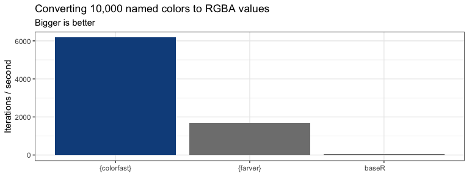

<!-- README.md is generated from README.Rmd. Please edit that file -->

# colorfast 

<!-- badges: start -->


[](https://github.com/coolbutuseless/colorfast/actions/workflows/R-CMD-check.yaml)
<!-- badges: end -->

`{colorfast}` is a package for converting R colors and hexadecimal
colors to arrays of RGBA values, and packed integer format (suitable for
native rasters).

### What’s in the box

- `col_to_rgb()` a faster version of `col2rgb()`
- `col_to_int()` for conversion of colors to packed integer format used
  in native rasters (4 bytes for each RGBA color channel are packed into
  a single R integer)

## Installation

You can install from
[GitHub](https://github.com/coolbutuseless/colorfast) with:

``` r
# install.package('remotes')
remotes::install_github('coolbutuseless/colorfast')
```

## Example

``` r
library(colorfast)

col_to_rgb(c("hotpink", "#abc", "#aabb99", "#aabb9980"))
#>       [,1] [,2] [,3] [,4]
#> red    255  170  170  170
#> green  105  187  187  187
#> blue   180  204  153  153
#> alpha  255  255  255  128
col_to_int(c("hotpink", "#abc", "#aabb99", "#aabb9980"))
#> [1]    -4953601    -3359830    -6702166 -2137408598
```

## Benchmarks

The following benchmarks compare `{colorfast}` to `{farver}` and base R.

| package       | Convert to RGBA array | Convert to packed integer |
|---------------|-----------------------|---------------------------|
| Base R        | `col2rgb()`           | N/A                       |
| `{farver}`    | `decode_colour()`     | `encode_native()`         |
| `{colorfast}` | `col_to_rgb()`        | `col_to_int()`            |

<details>

<summary>

Click to show raw benchmark results
</summary>

``` r
#~~~~~~~~~~~~~~~~~~~~~~~~~~~~~~~~~~~~~~~~~~~~~~~~~~~~~~~~~~~~~~~~~~~~~~~~~~~~
# R color names
#~~~~~~~~~~~~~~~~~~~~~~~~~~~~~~~~~~~~~~~~~~~~~~~~~~~~~~~~~~~~~~~~~~~~~~~~~~~~
cols <- sample(colors(), 10000, T)


#~~~~~~~~~~~~~~~~~~~~~~~~~~~~~~~~~~~~~~~~~~~~~~~~~~~~~~~~~~~~~~~~~~~~~~~~~~~~
# Check we all agree on the RGB representation
#~~~~~~~~~~~~~~~~~~~~~~~~~~~~~~~~~~~~~~~~~~~~~~~~~~~~~~~~~~~~~~~~~~~~~~~~~~~~
a1 <- col_to_rgb(cols)
a2 <- col2rgb(cols, alpha = TRUE)
a3 <- farver::decode_colour(cols) |> t()
a3 <- rbind(a3, 255L)
rownames(a3) <- c('red', 'green', 'blue', 'alpha')
stopifnot(identical(a1, a2))
stopifnot(identical(a2, a3))


res_col <- bench::mark(
  `baseR         ` = col2rgb(cols, alpha = TRUE),
  `{farver}`       = decode_colour(cols),
  `{colorfast}`    = col_to_rgb(cols),
  check = FALSE
)
knitr::kable(res_col[,1:5])
```

| expression  |   min |  median |    itr/sec | mem_alloc |
|:------------|------:|--------:|-----------:|----------:|
| baseR       |  16ms |  16.2ms |   61.44687 |     313KB |
| {farver}    | 568µs | 586.8µs | 1691.64261 |     117KB |
| {colorfast} | 148µs | 157.1µs | 6288.31832 |     156KB |

``` r


#~~~~~~~~~~~~~~~~~~~~~~~~~~~~~~~~~~~~~~~~~~~~~~~~~~~~~~~~~~~~~~~~~~~~~~~~~~~~
#
# Hex colors
#
#~~~~~~~~~~~~~~~~~~~~~~~~~~~~~~~~~~~~~~~~~~~~~~~~~~~~~~~~~~~~~~~~~~~~~~~~~~~~
cols <- sample(colors(), 100000, T) |>
  col_to_rgb() |>
  t() |>
  rgb(maxColorValue = 255)

#~~~~~~~~~~~~~~~~~~~~~~~~~~~~~~~~~~~~~~~~~~~~~~~~~~~~~~~~~~~~~~~~~~~~~~~~~~~~
# Check we all agree on the RGB representation
#~~~~~~~~~~~~~~~~~~~~~~~~~~~~~~~~~~~~~~~~~~~~~~~~~~~~~~~~~~~~~~~~~~~~~~~~~~~~
a1 <- col_to_rgb(cols)
a2 <- col2rgb(cols, alpha = TRUE)
a3 <- farver::decode_colour(cols) |> t()
a3 <- rbind(a3, 255L)
rownames(a3) <- c('red', 'green', 'blue', 'alpha')
stopifnot(identical(a1, a2))
stopifnot(identical(a2, a3))

#~~~~~~~~~~~~~~~~~~~~~~~~~~~~~~~~~~~~~~~~~~~~~~~~~~~~~~~~~~~~~~~~~~~~~~~~~~~~
# benchmark
#~~~~~~~~~~~~~~~~~~~~~~~~~~~~~~~~~~~~~~~~~~~~~~~~~~~~~~~~~~~~~~~~~~~~~~~~~~~~
library(farver)
res_hex <- bench::mark(
  baseR         = col2rgb(cols, alpha = TRUE),
  `{farver}`    = decode_colour(cols, alpha = TRUE),
  `{colorfast}` = col_to_rgb(cols),
  check = FALSE
)
knitr::kable(res_hex[,1:5])
```

| expression  |     min |   median |   itr/sec | mem_alloc |
|:------------|--------:|---------:|----------:|----------:|
| baseR       |   2.8ms |   2.98ms |  332.0594 |    3.05MB |
| {farver}    | 894.8µs |   1.04ms |  953.7226 |    3.05MB |
| {colorfast} | 478.8µs | 540.95µs | 1821.1662 |    1.53MB |

``` r


#~~~~~~~~~~~~~~~~~~~~~~~~~~~~~~~~~~~~~~~~~~~~~~~~~~~~~~~~~~~~~~~~~~~~~~~~~~~~
# Conversion to packed int
#~~~~~~~~~~~~~~~~~~~~~~~~~~~~~~~~~~~~~~~~~~~~~~~~~~~~~~~~~~~~~~~~~~~~~~~~~~~~
cols <- sample(colors(), 100000, T) |>
  col_to_rgb() |>
  t() |>
  rgb(maxColorValue = 255)


#~~~~~~~~~~~~~~~~~~~~~~~~~~~~~~~~~~~~~~~~~~~~~~~~~~~~~~~~~~~~~~~~~~~~~~~~~~~~
# benchmark
#~~~~~~~~~~~~~~~~~~~~~~~~~~~~~~~~~~~~~~~~~~~~~~~~~~~~~~~~~~~~~~~~~~~~~~~~~~~~
library(farver)
res_int <- bench::mark(
  `{farver}`    = encode_native(cols),
  `{colorfast}` = col_to_int(cols),
  check = TRUE
)

knitr::kable(res_int[,1:5])
```

| expression  |   min | median |  itr/sec | mem_alloc |
|:------------|------:|-------:|---------:|----------:|
| {farver}    | 799µs |  832µs | 1189.928 |     397KB |
| {colorfast} | 506µs |  535µs | 1831.527 |     391KB |

``` r


#~~~~~~~~~~~~~~~~~~~~~~~~~~~~~~~~~~~~~~~~~~~~~~~~~~~~~~~~~~~~~~~~~~~~~~~~~~~~
# Conversion to packed int
#~~~~~~~~~~~~~~~~~~~~~~~~~~~~~~~~~~~~~~~~~~~~~~~~~~~~~~~~~~~~~~~~~~~~~~~~~~~~
cols <- sample(colors(), 10000, T) 


#~~~~~~~~~~~~~~~~~~~~~~~~~~~~~~~~~~~~~~~~~~~~~~~~~~~~~~~~~~~~~~~~~~~~~~~~~~~~
# benchmark
#~~~~~~~~~~~~~~~~~~~~~~~~~~~~~~~~~~~~~~~~~~~~~~~~~~~~~~~~~~~~~~~~~~~~~~~~~~~~
library(farver)
res_int2 <- bench::mark(
  `{farver}`    = encode_native(cols),
  `{colorfast}` = col_to_int(cols),
  check = TRUE
)

knitr::kable(res_int2[,1:5])
```

| expression  |   min | median |  itr/sec | mem_alloc |
|:------------|------:|-------:|---------:|----------:|
| {farver}    | 548µs |  559µs | 1776.747 |    39.1KB |
| {colorfast} | 144µs |  148µs | 6624.740 |    39.1KB |

</details>




